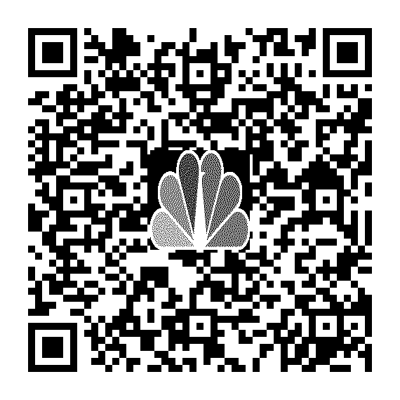

= SecQR
:toc: macro
:toc-title:

The Security Solution for QR codes.

== Description

anySecQR aims to revolutionize QR code security by introducing multi-factor authentication (MFA) and malicious content detection. This project addresses the vulnerability of traditional QR codes, where anyone with a scanner can access the encoded data.

=== Key Features:

==== Multi-Factor Authentication: 
SecQR introduces an extra layer of security by requiring additional verification beyond just scanning the QR code. This could involve a PIN, biometric authentication (fingerprint, facial recognition), or a one-time passcode delivered via a trusted channel.

==== ISO Standard Compliance:
SecQR validates the QR code's compliance with the ISO/IEC 18004:2015 standard, and older ISO standards like ISO/IEC 18004:2006 and ISO/IEC 18004:2000 to ensure the QR code is correctly formatted and encoded.

==== URL Safety Validation: 
Upon scanning a QR code containing a URL, SecQR utilizes multiple URL testing APIs (e.g., Google Safe Browsing) to assess website safety. Users receive a score (0% - Not Safe, 100% - Safe) to guide their browsing decision.
Malicious Content Detection / QR Code Vulnerability 

==== Scanning: 
SecQR leverages Large Language Models (LLMs) to scan encoded data within the QR code for potential hacking attempts.

==== The LLM identifies vulnerabilities such as:
1. _SQL Injection_
2. _Cross-Site Scripting (XSS)_
3. _Command Injection_
4. _Format String Vulnerabilities_
5. _XML External Entity Injection (XXE)_
6. _String Fuzzing_
7. _Server-Side Includes (SSI) Injection_
8. _Local File Inclusion (LFI) & Directory Traversal_
9. _Custom vulnerabilities specified through a wordlist_

==== User-Friendly Interface: 
SecQR provides a user-friendly interface that displays the verification status (MFA), URL safety score, and any detected malicious content within the QR code.
Benefits:

==== Enhanced Security: 
MFA and malicious content detection significantly reduce the risk of unauthorized access to sensitive information and malicious website redirection.

==== Increased Trust: 
Users gain confidence when scanning QR codes, knowing the data is secure and the website is safe.

==== Reduced Phishing Attacks: 
SecQR mitigates phishing attempts disguised as QR codes, protecting users from fraudulent activities.

== Installation

To install the project, you need to have Python 3.10 installed. Then, you can use Poetry to manage the dependencies:

====
This xref:pyproject.toml[pyptojec.toml] file will be used to install the dependencies using Poetry

secrets.yaml file will be used to store the API keys for the URL safety validation, the format of the secrets.yaml file is as follows:

[source, yaml]
google_api:
  api_token: 'Google API Token'
  model: "models/text-bison-001"

====

```sh
pip install poetry

poetry install --no-dev --no-root --locked
```

Then you can run the project using the following command:

```sh
python SecQR_V_1_0_2.py
```
Then you can test the project using the QR codes from 'QR_codes' folder.

Example QR codes:

image:QR_codes/xss.png[Cross-Site Scripting (XSS), 150, 150, align="center"]

== Usage

To use SecQR, run the SecQR_V_1_0_2.py script. This will start the QR code detection and decoding process.

== Contributing

Contributions are welcome. Please make sure to update tests as appropriate.